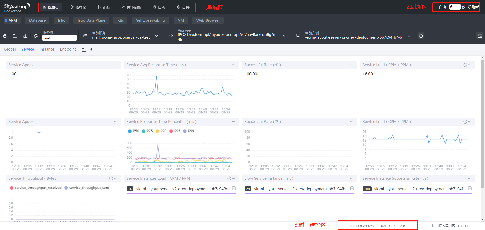
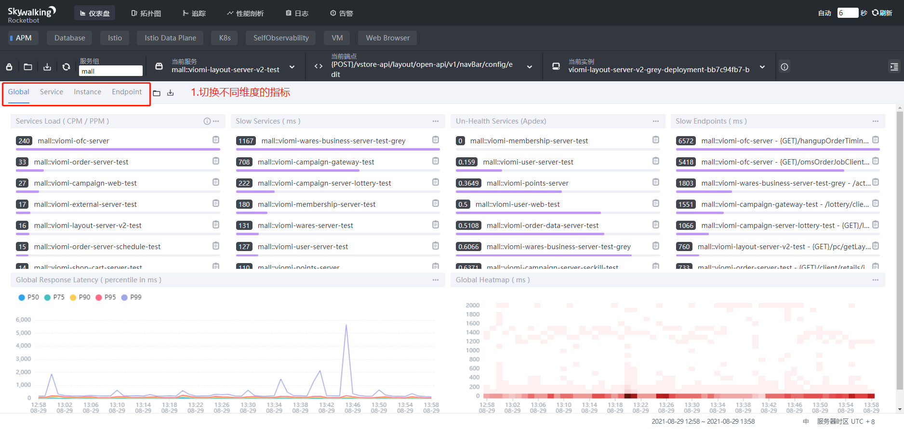
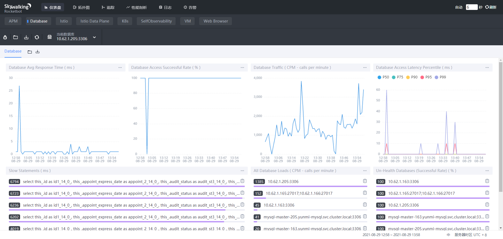
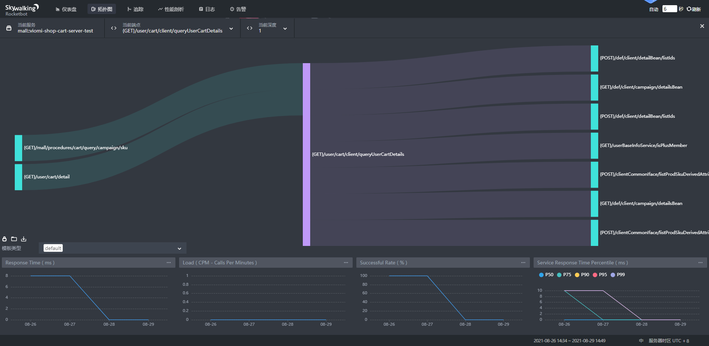
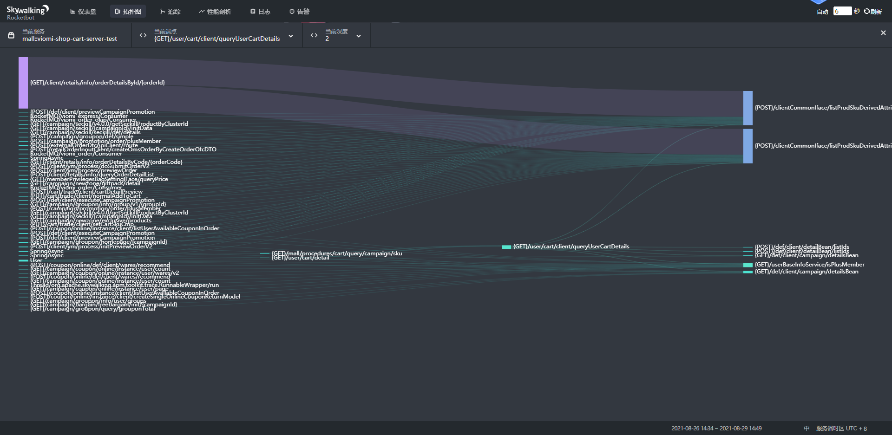
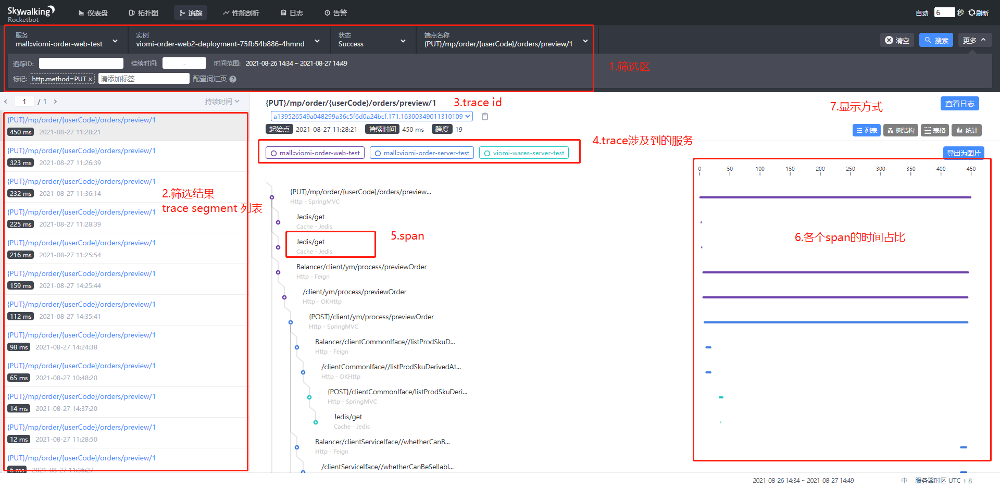
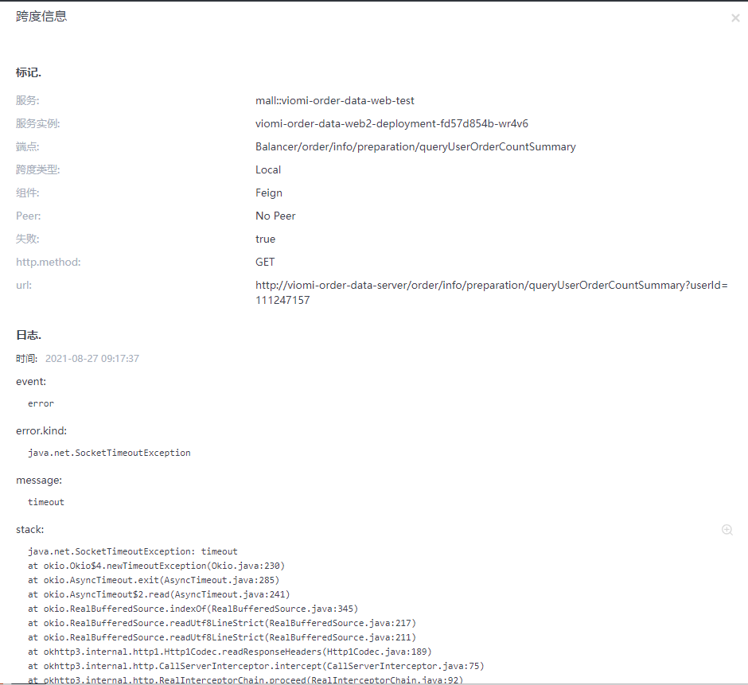
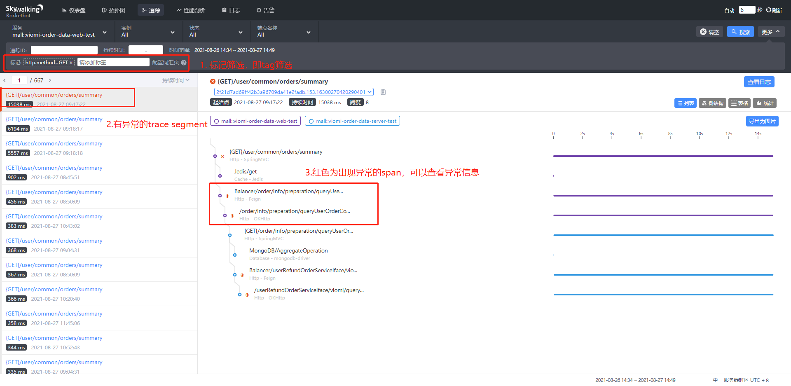
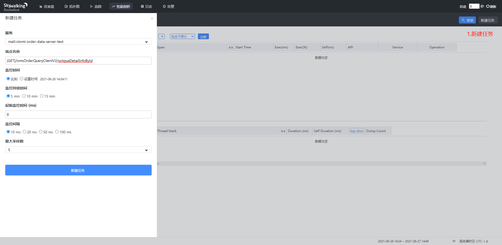
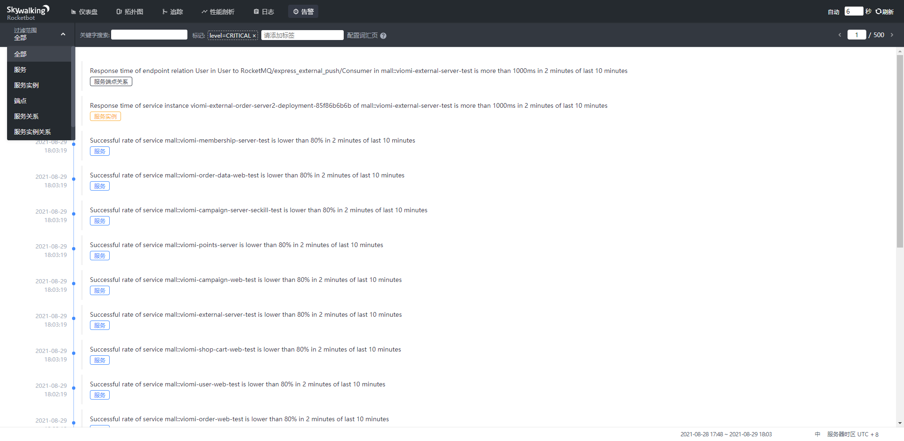

# skywalking 简介与使用场景演示

[toc]


## 一、skywalking 简介

### 1.1 什么是skywalking

skywalking 是一个分布式追踪系统 ，也是一个应用性能管理(APM)平台。

> 1. 分布式追踪旨在追踪分布式应用之间的请求，找出性能瓶颈。
>
> 2. APM(Application Performance Management)的核心是监控和管理应用的性能和可用性，通过探查和诊断应用复杂的性能指标来维护一个预期的服务等级水平(SLA).

skywalking 通过探针等方式无侵入自动收集分布式应用的trace数据、metrics数据或者log数据，梳理构建服务与服务之间、应用与应用之间、请求与请求之间的关系，并进行指标统计和分析，通过UI界面可以比较直观的观测各个维度的关联性和性能表现情况。

### 1.2 skywalking 的整体架构


* 探针：收集，格式化数据。支持java agent，浏览器agent，sidecar等方式。
* server：由Receiver(接收器)和Aggregator(聚合器)组成，也可以分开部署。
* 存储：可选多种存储。
* UI: 支持自定义的UI界面。

## 二、 skywalking UI 简介

skywalking ui中有以下3个公共的模块，这些模块在每个功能：

* 导航区：切换到不同的功能区。

* 刷新区：刷新数据。

* 时间选择区：选择时间范围

  > 如果发现没有数据，刷新页面不一定有用，可以点击刷新按钮进行刷新



### 2.1 仪表板

#### 2.1.1 APM模块

仪表板的APM模块提供全局，服务，实例，端点的监控指标。



**指标**说明如下：

* service load， 服务负载。CPM表示每分钟请求(针对RPC服务)，PPM表示每分钟数据包(针对TCP服务)

* slow services，平均响应最慢的topN服务。

* un-healthy services, 不健康的服务。Apdex分数最差的topN服务。

  > Apdex，即应用性能指数(Application Performance Index)，用于度量应用的性能。Apdex 按照响应时间，将请求分为用户满意，用户可容忍，用户不能容忍3个等级。假设用户满意的最大响应时间为t，则可容忍的最大响应时间为4t，不可容忍大于4t的响应时间。skywalking默认设置的t是500ms。
  >
  > Apdex得分 = (满意的请求数 + 可容忍的请求数 * 0.5）/ 总的请求数 。

* slow enpoints, 平均响应最慢的topN端点。
* global response latency，全局响应延迟，按照分位数进行展示。比如p90的值为270，表示百分之90的请求都在这个响应延迟之内。
* global heatmap，全局热图，相当于对请求按照响应时间进行分桶。比如鼠标移动到特定的方块，显示200ms[2]，则表示此时有两个请求落入到100~200ms这个桶中。
* successful rate，成功比率。对于http请求而言，意味着返回200响应码的请求占比。

**条件筛选**说明如下：

* 服务组(group)，agent名称的前缀部分，比如在deploy.yml文件中配置了agent名称为mall::viomi-xxx-server，那么所在的服务组就是mall。
* 服务(service) ，多个实例的抽象，服务名称是deploy.yml文件中配置的skywalking agent名称。
* 实例(instance) ，具体的某个实例，实例名称一一对应这k8s中的pod名称。
* 端点(endpoint) ，指服务请求的路径，比如http请求路径的URI + 请求方法。

#### 2.1.2 Database模块

database模块提供数据库访问的响应时间，每分钟请求数，请求成功率，慢查询语句等功能。



### 2.2 拓扑图

拓扑图显示服务与服务之间的联系。


说明：

* 在上图第4点中提及的端点依赖图，可通过六边形左下角的图案进去。

> 端点依赖图(endpoint dependency map)展示了从上游到下游，有哪些端点依赖到了该端点。通过设置深度，可以递归的显示端点的依赖。还可以点击某个端点查看相关的endpoint指标。
>
> 比如下面两张图是shop-cart-server-test服务下的/user/cart/client/queryUserCartDetails的端点依赖情况，分别展示了其上游和下游深度为1以及深度为2的端点依赖。





### 2.3 追踪

追踪提供了根据多种条件进行筛选链路追踪的数据。

#### 2.3.1 查看追踪

页面可以分为以下几个区域。



为了更好的理解链路上的信息，需要先了解skywalking关于分布式链路追踪中涉及到的概念：

* Trace 调用链。是一个抽象的概念，将多个trace segment中的span集合进行处理，形成由span组成的有向无环图（DAG图）。
* Trace Segment 链路段。简单理解为一个线程上的所有span的集合。
* Span 跨度。可以理解为一个具有完整时间周期的程序访问。比如一次方法调用, 一个程序块的调用, 或者一次RPC/数据库访问。span与span之间通过嵌套或者顺序排列建立逻辑因果关系。
  * span中可以打标签(tag)。tag以key-value的形式存在，用于对span的注解和补充。
  * span包括以下3中类型
    * EntrysSpan：请求进入当前服务时创建的span。
    * LocalSpan: 本地调用时创建的span。
    * ExitSpan: 请求离开当前服务时，创建的Span。

点击某个span，可以查看该span的具体信息。

* 如果有异常，可以查看异常
* 如果是数据库访问，可以查看相关的语句




#### 2.3.2 筛选追踪



* 标记 筛选

  使用标记筛选时，按照key=value的格式输入之后，按回车，生成如图所示的效果之后才能生效。

  默认仅仅支持以下标记(tag)，如果你自定义了span的tag，可以在skywalking服务端进行配置，使得可以根据自定义的tag来筛选。

  > http.method,status_code,db.type,db.instance,mq.queue,mq.topic,mq.broker

### 2.4 性能剖析

性能剖析是7.0新增的一个特性。

可以配置某个服务的某个端点进行监视，实时采集服务的线程堆栈信息，获取到方法级别的执行时间。



新建任务涉及的配置项：

* 服务：指定端点所在的服务。
* 端点名称：指定端点名称。可以在【仪表板】或者【追踪】模块复制，避免写错。
* 监控时间：指定什么时候开始监控。
* 监控持续时间：在这个时间窗口内，应用的线程堆栈会频繁地被采集。
* 起始监控时间：如果endpoint的某一次请求小于该时间，则不会被采集，避免只收集到好的情况。
* 监控间隔：线程堆栈每隔多久被dump。
* 最大采样率：每个实例最多采集多个样本。

> 注意：
>
> 一个服务只能同时监控1个端点。
>
> 如果端点访问次数较低，或者执行时间比监控间隔还要短，可能会出现没有采集到的数据。

当sampled Traces中出现追踪时，就可以进行分析。


### 2.5 日志

skywalking支持通过filebeat等采集工具将日志收集发送到skywalking中，进而可以方便的根据trace id来查找整个链路的日志。

> 由于我们已经通过ELK来收集日志，并且通过skywalking的工具将trace id注入到logback的日志输出中，因此我们可以直接在kibana上根据trace id来搜索需要的日志，不需要使用skywalking这个特性。
>
> 如果应用还未实现，请查考 [4.2 应用日志关联skywalking trace id](###4.2 应用日志关联skywalking trace id)。

### 2.6 告警

告警页面展示了所有被触发了的告警。



目前UI上不支持配置，需要在skywalking server端进行配置。

支持多个维度的筛选，关键字筛选和标记筛选

> 标记筛选目前仅仅支持level标记。比如level=CRITICAL等。

## 三、skywalking 典型使用场景

### 3.1 系统感知

根据【仪表板】的统计指标了解系统，服务，实例，端点的表现；

配置【预警】监视指标和阈值，及时感知异常。

### 3.2 追踪请求链路，分析链路中造成性能问题的薄弱环节

通过【追踪】找到对应trace，分析有哪些span，哪些span的耗时较长。

找到慢span对应的服务，通过【仪表板】分析服务，服务实例，端点的各项指标统计情况

....

### 3.3 新版本接口上线，需要找出那些还在使用旧接口的应用

利用【拓扑】找到那些服务在以client的模式在调用该服务；

利用【拓扑】中的endpoint dependency map找到该接口目前被哪些上游端点所依赖；

利用【追踪】筛选该接口的所有追踪，分析链路中涉及到哪些应用。

### 3.4 某个端点响应很慢，不知慢在哪里(从trace中看不出来)

利用【仪表板】先排除应用运行状况的问题；

利用【性能剖析】模块进行方法级别剖析，还可以将执行了哪些切面展示出来，比代码上写stopwatch更加方便。


## 四、skywalking 常见api使用

skywalking 提供应用层的api可以在代码中使用，这些api只有在启用skywalking agent的时候才会生效。

这里仅列举常见api，具体详见[文档](https://skywalking.apache.org/docs/main/v8.7.0/readme/)

### 4.1 操作当前trace上下文

* 引入依赖

  ```
  <dependency>
        <groupId>org.apache.skywalking</groupId>
        <artifactId>apm-toolkit-trace</artifactId>
     </dependency>
  ```

  > 请继承于顶级项目，以便获取统一的版本

* 获取trace id

  ```
  import org.apache.skywalking.apm.toolkit.trace.TraceContext;
  ...
  TraceContext.traceId()
  ```

* 获取span id

  ```
  import org.apache.skywalking.apm.toolkit.trace.TraceContext;
  ...
  TraceContext.spanId()
  ```

* 添加local span

  使用@Trace添加一个local span，

  ```
  import org.apache.skywalking.apm.toolkit.trace.Trace;
  ...
  @Trace(operationName = "my local span")
  private void myLocalSpan() {
  	...
  }
  ```

* 添加tag

  使用注解@Tag

  ```
  import org.apache.skywalking.apm.toolkit.trace.Tag;
  ...
  @Tag(key = "myTagKey", value = "arg[0]")
  private void myLocalSpan(int num) {
  	...
  }
  ```

  > 使用注解的方式，value需要和[Customize Enhance Trace](https://skywalking.apache.org/docs/main/v8.7.0/en/setup/service-agent/java-agent/customize-enhance-trace)支持的一样，比如上面的arg[0]标识拿到第一个参数。

  或者使用ActiveSpan.tag(key， value)

  ```
  import org.apache.skywalking.apm.toolkit.trace.ActiveSpan;
  ...
  private void myLocalSpan(int num) {
  	ActiveSpan.tag("my_tag", "my_value");
  }
  ```

* 跨线程处理

  > skywalking 默认不支持跨线程传递，可通过以下方式进行包装，实现跨线程追踪

  详见[trace-cross-thread](https://skywalking.apache.org/docs/main/v8.7.0/en/setup/service-agent/java-agent/application-toolkit-trace-cross-thread/)

### 4.2 应用日志关联skywalking trace id

> 这里仅适合logback，如果需要log4j或者log4j2，请参考[文档](https://skywalking.apache.org/docs/main/v8.7.0/en/setup/service-agent/java-agent/application-toolkit-log4j-1.x/)。版本使用顶级父项目的统一版本即可。

* 引入依赖

  ```
      <dependency>
           <groupId>org.apache.skywalking</groupId>
           <artifactId>apm-toolkit-logback-1.x</artifactId>
       </dependency>
  ```

  > 请继承于顶级项目，以便获取统一的版本

* 设置appender的encoder

  > 假设需要对控制台输出(ConsoleAppender)日志关联trace id，可如下配置。
  >
  > 其中%tid表示trace id

  ```
  <appender name="STDOUT" class="ch.qos.logback.core.ConsoleAppender">
  	<encoder class="ch.qos.logback.core.encoder.LayoutWrappingEncoder">
  		<layout class="org.apache.skywalking.apm.toolkit.log.logback.v1.x.TraceIdPatternLogbackLayout">
          	<Pattern>%d{yyyy-MM-dd HH:mm:ss.SSS} [%tid] [%thread] %-5level %logger{36} -%msg%n</Pattern>
          </layout>
      </encoder>
  </appender>
  ```

