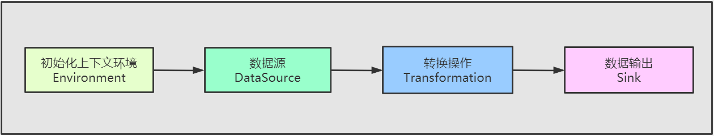
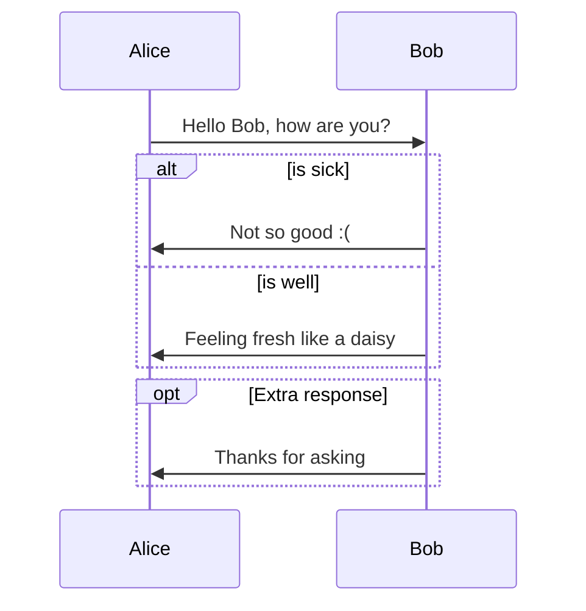

## 1️⃣ 一 、课前准备

1. 掌握前面的flink知识


$$
\begin{align*}
y = y(x,t) &= A e^{i\theta} \\
&= A (\cos \theta + i \sin \theta) \\
&= A (\cos(kx - \omega t) + i \sin(kx - \omega t)) \\
&= A\cos(kx - \omega t) + i A\sin(kx - \omega t)  \\
&= A\cos \Big(\frac{2\pi}{\lambda}x - \frac{2\pi v}{\lambda} t \Big) + i A\sin \Big(\frac{2\pi}{\lambda}x - \frac{2\pi v}{\lambda} t \Big)  \\
&= A\cos \frac{2\pi}{\lambda} (x - v t) + i A\sin \frac{2\pi}{\lambda} (x - v t)
\end{align*}
$$


$$\gamma_{n} = \frac{ 
\left | \left (\mathbf x_{n} - \mathbf x_{n-1} \right )^T 
\left [\nabla F (\mathbf x_{n}) - \nabla F (\mathbf x_{n-1}) \right ] \right |}
{\left \|\nabla F(\mathbf{x}_{n}) - \nabla F(\mathbf{x}_{n-1}) \right \|^2}$$

{}
A Markdown aside is useful for displaying notices, hints, or definitions to your readers.
{}


<div style="callout:success">
 Lorem ipsum
</div>


 You found me! 


## 2️⃣ 二 、课堂主题

1. 掌握DataStream常见的API开发
2. 掌握DataSet常见的API开发


## 3️⃣ 三 、课程目标

1. 掌握常见的DataStream常见的source
2. 掌握常见的DataStream的transformation操作
3. 掌握常见的DataStream的sink操作
4. 了解入门的DataSet API算子


## 4️⃣ 四 、知识要点

### 📖  1. DataStream 的编程模型 

* DataStream 的编程模型包括四个部分：Environment、DataSource、Transformation、Sink

  


### 📖  2. Flink的DataSource数据源

#### 2.1 基于文件


> readTextFile(path)
> 读取文本文件，文件遵循TextInputFormat读取规则，逐行读取并返回。


* 案例

```scala
package com.kaikeba.demo1
import org.apache.flink.api.scala.{ DataSet, ExecutionEnvironment}

//todo:  scala开发flink的批处理程序


object FlinkFileCount {
   
  def main(args: Array[String]): Unit = {

    //todo:1、构建Flink的批处理环境
    val env: ExecutionEnvironment = ExecutionEnvironment.getExecutionEnvironment

    //todo:2、读取数据文件
    val fileDataSet: DataSet[String] = env.readTextFile("d:\\words.txt")

    import org.apache.flink.api.scala._

    //todo: 3、对数据进行处理
    val resultDataSet: AggregateDataSet[(String, Int)] = fileDataSet
                                                                    .flatMap(x=> x.split(" "))
                                                                    .map(x=>(x,1))
                                                                    .groupBy(0)
                                                                    .sum(1)

    //todo: 4、打印结果
    resultDataSet.print()

    //todo: 5、保存结果到文件
    resultDataSet.writeAsText("d:\\result")

    env.execute("FlinkFileCount")
  }
}

```


#### 2.2 基于socket

~~~
socketTextStream
从socker中读取数据，元素可以通过一个分隔符切开。
~~~

* 案例



  

  

  ~~~scala
  package com.kaikeba.demo1
  
  import org.apache.flink.streaming.api.scala.{DataStream, StreamExecutionEnvironment}
  
  //todo: 通过scala开发flink流处理作业
  object WordCountStreamScala {
  
    def main(args: Array[String]): Unit = {
  
      //构建流处理的环境
      val env: StreamExecutionEnvironment = StreamExecutionEnvironment.getExecutionEnvironment
  
      //从socket获取数据
      val sourceStream: DataStream[String] = env.socketTextStream("node01",9999)
  
      //导入隐式转换的包
      import org.apache.flink.api.scala._
  
      //对数据进行处理
      val result: DataStream[(String, Int)] = sourceStream
        .flatMap(x => x.split(" ")) //按照空格切分
        .map(x => (x, 1))           //每个单词计为1
        .keyBy(0)                   //按照下标为0的单词进行分组
        .sum(1)                     //按照下标为1累加相同单词出现的次数
  
      //对数据进行打印
      result.print()
  
      //开启任务
      env.execute("WordCountStreamScala")
  
  
    }
  }
  ~~~


#### 2.3 基于集合

~~~
fromCollection(Collection)
通过collection集合创建一个数据流，集合中的所有元素必须是相同类型的。

~~~

* 案例

  ~~~scala
  package com.kaikeba.demo2
  
  import org.apache.flink.streaming.api.scala.{DataStream, StreamExecutionEnvironment}
  import org.apache.flink.api.scala._
  
  //todo: 基于数组或者集合构建DataStream
  object StreamingSourceFromCollection {
  
    def main(args: Array[String]): Unit = {
      //todo: 1、获取流式处理环境
      val environment: StreamExecutionEnvironment = StreamExecutionEnvironment.getExecutionEnvironment
  
      //todo: 2、准备数据源--数组
      val array = Array("hello world","world spark","flink test","spark hive","test")
      val fromArray: DataStream[String] = environment.fromCollection(array)
  
  
      //  val value: DataStream[String] = environment.fromElements("hello world")
      //todo: 3、数据处理
      val resultDataStream: DataStream[(String, Int)] = fromArray
                                                                .flatMap(x => x.split(" "))
                                                                .map(x =>(x,1))
                                                                .keyBy(0)
                                                                .sum(1)
  
      //todo: 4、打印
      resultDataStream.print()
  
      //todo: 5、启动
      environment.execute()
  
  
    }
  }
  ~~~


#### 2.4 自定义输入

~~~
addSource 
可以实现读取第三方数据源的数据
~~~

掌握前面的flink知识
自定义单并行度数据源

* 自定义单并行度数据源

  * 继承SourceFunction来自定义单并行度source

  * 代码开发

    ~~~scala
    package com.kaikeba.demo2
    
    import org.apache.flink.streaming.api.functions.source.SourceFunction
    import org.apache.flink.streaming.api.scala.{DataStream, StreamExecutionEnvironment}
    import org.apache.log4j.{Level, Logger}
    
    /**
      * todo: 自定义单并行度source
      *
      */
    object MySourceRun {
      Logger.getLogger("org").setLevel(Level.ERROR)
    
      def main(args: Array[String]): Unit = {
        //todo: 构建流处理环境
        val environment: StreamExecutionEnvironment = StreamExecutionEnvironment.getExecutionEnvironment
        import org.apache.flink.api.scala._
    
        //todo: 添加自定义source    获取数据源的source task 个数为1，单并行度
        val getSource: DataStream[Long] = environment.addSource(new MySource)
    
    
        //todo: 过滤处理
        val resultStream: DataStream[Long] = getSource.filter(x => x %2 ==0)
        resultStream.setParallelism(1).print()
    
    
        //todo： 启动
        environment.execute()
      }
    }
    
    //todo: 自定义单并行度source
    class MySource extends SourceFunction[Long] {
      private var number = 1L
      private var isRunning = true
    
      override def run(sourceContext: SourceFunction.SourceContext[Long]): Unit = {
        //todo: 不断的产生数据
        while (isRunning){
            number += 1
            sourceContext.collect(number)
            Thread.sleep(1000)
        }
      }
      override def cancel(): Unit = {
        isRunning = false
      }
    }
    
    ~~~

* 自定义多并行度数据源

  * 继承ParallelSourceFunction来自定义多并行度的source

  * 代码开发

    ~~~scala
    package com.kaikeba.demo2
    
    import org.apache.flink.streaming.api.functions.source.{ParallelSourceFunction, RichSourceFunction, SourceFunction}
    import org.apache.flink.streaming.api.scala.{DataStream, StreamExecutionEnvironment}
    import org.apache.log4j.{Level, Logger}
    
    /**
      * todo： 自定义多并行度的source
      */
    object MyMultipartSourceRun {
       Logger.getLogger("org").setLevel(Level.ERROR)
    
      def main(args: Array[String]): Unit = {
         //todo: 1、构建流处理环境
        val environment: StreamExecutionEnvironment = StreamExecutionEnvironment.getExecutionEnvironment
        import org.apache.flink.api.scala._
    
        //todo: 2、添加source
        val getSource: DataStream[Long] = environment.addSource(new MultipartSource).setParallelism(2)
    
        //todo: 3、过滤处理
        val resultStream: DataStream[Long] = getSource.filter(x => x %2 ==0)
    
        //todo: 4、打印输出
        resultStream.setParallelism(1).print()
    
        //todo: 5、启动
        environment.execute()
      }
    }
    
    
    //todo: 自定义多并行度的source
    class MultipartSource  extends ParallelSourceFunction[Long]{
      private var number = 1L
      private var isRunning = true
    
      override def run(sourceContext: SourceFunction.SourceContext[Long]): Unit = {
        while(true){
          number +=1
          sourceContext.collect(number)
          Thread.sleep(1000)
        }
    
      }
    
      override def cancel(): Unit = {
        isRunning = false
    
      }
    }
    
    ~~~


* 此外系统内置提供了一批connectors，连接器会提供对应的source支持
  * [Apache Kafka](https://ci.apache.org/projects/flink/flink-docs-release-1.8/dev/connectors/kafka.html) (source/sink)  **后面重点分析**
  * [Apache Cassandra](https://ci.apache.org/projects/flink/flink-docs-release-1.8/dev/connectors/cassandra.html) (sink)
  * [Amazon Kinesis Streams](https://ci.apache.org/projects/flink/flink-docs-release-1.8/dev/connectors/kinesis.html) (source/sink)
  * [Elasticsearch](https://ci.apache.org/projects/flink/flink-docs-release-1.8/dev/connectors/elasticsearch.html) (sink)
  * [Hadoop FileSystem](https://ci.apache.org/projects/flink/flink-docs-release-1.8/dev/connectors/filesystem_sink.html) (sink)
  * [RabbitMQ](https://ci.apache.org/projects/flink/flink-docs-release-1.8/dev/connectors/rabbitmq.html) (source/sink)
  * [Apache NiFi](https://ci.apache.org/projects/flink/flink-docs-release-1.8/dev/connectors/nifi.html) (source/sink)
  * [Twitter Streaming API](https://ci.apache.org/projects/flink/flink-docs-release-1.8/dev/connectors/twitter.html) (source)


### 📖  3. Flink的Sink数据目标

- writeAsText()：将元素以字符串形式逐行写入，这些字符串通过调用每个元素的toString()方法来获取
- print() / printToErr()：打印每个元素的toString()方法的值到标准输出或者标准错误输出流中
- 自定义输出addSink【kafka、redis】
- 我们可以通过sink算子，将我们的数据发送到指定的地方去，例如kafka或者redis或者hbase等等，前面我们已经使用过将数据打印出来调用print()方法，接下来我们来实现自定义sink将我们的数据发送到redis里面去
  - [Apache Kafka](https://ci.apache.org/projects/flink/flink-docs-release-1.9/dev/connectors/kafka.html) (source/sink)
  - [Apache Cassandra](https://ci.apache.org/projects/flink/flink-docs-release-1.9/dev/connectors/cassandra.html) (sink)
  - [Amazon Kinesis Streams](https://ci.apache.org/projects/flink/flink-docs-release-1.9/dev/connectors/kinesis.html) (source/sink)
  - [Elasticsearch](https://ci.apache.org/projects/flink/flink-docs-release-1.9/dev/connectors/elasticsearch.html) (sink)
  - [Hadoop FileSystem](https://ci.apache.org/projects/flink/flink-docs-release-1.9/dev/connectors/filesystem_sink.html) (sink)
  - [RabbitMQ](https://ci.apache.org/projects/flink/flink-docs-release-1.9/dev/connectors/rabbitmq.html) (source/sink)
  - [Apache NiFi](https://ci.apache.org/projects/flink/flink-docs-release-1.9/dev/connectors/nifi.html) (source/sink)
  - [Twitter Streaming API](https://ci.apache.org/projects/flink/flink-docs-release-1.9/dev/connectors/twitter.html) (source)
  - [Google PubSub](https://ci.apache.org/projects/flink/flink-docs-release-1.9/dev/connectors/pubsub.html) (source/sink)


#### 3.1  Flink写数据到redis中

* 导入flink整合redis的jar包

  ~~~xml
  <dependency>
      <groupId>org.apache.bahir</groupId>
      <artifactId>flink-connector-redis_2.11</artifactId>
      <version>1.0</version>
  </dependency>
  ~~~

* 代码开发

  ~~~scala
  package com.kaikeba.redis
  
  import org.apache.flink.streaming.api.scala.{DataStream, StreamExecutionEnvironment}
  import org.apache.flink.streaming.connectors.redis.RedisSink
  import org.apache.flink.streaming.connectors.redis.common.config.FlinkJedisPoolConfig
  import org.apache.flink.streaming.connectors.redis.common.mapper.{RedisCommand, RedisCommandDescription, RedisMapper}
  import org.apache.flink.api.scala._
  
  //todo: Flink实时程序处理保存结果到redis中
  object Stream2Redis {
  
    def main(args: Array[String]): Unit = {
      //todo: 1、获取程序入口类
      val executionEnvironment: StreamExecutionEnvironment = StreamExecutionEnvironment.getExecutionEnvironment
  
  
      //todo: 2、组织数据
      val streamSource: DataStream[String] = executionEnvironment.fromElements("1 hadoop","2 spark","3 flink")
  
      //todo: 3、数据处理
      //将数据包装成为key,value对形式的tuple
      val tupleValue: DataStream[(String, String)] = streamSource.map(x =>(x.split(" ")(0),x.split(" ")(1)))
  
  
      //todo: 4、构建RedisSink
      val builder = new FlinkJedisPoolConfig.Builder
  
        //设置redis客户端参数
        builder.setHost("node01")
        builder.setPort(6379)
        builder.setPassword("123456")
        builder.setTimeout(5000)
        builder.setMaxTotal(50)
        builder.setMaxIdle(10)
        builder.setMinIdle(5)
  
      val config: FlinkJedisPoolConfig = builder.build()
  
      //获取redis  sink
      val redisSink = new RedisSink[Tuple2[String,String]](config,new MyRedisMapper)
  
      //todo: 5、使用我们自定义的sink，实现数据写入到redis中
      tupleValue.addSink(redisSink)
  
      //todo: 6、执行程序
      executionEnvironment.execute("redisSink")
    }
  }
  
  //todo: 定义一个RedisMapper类
  class MyRedisMapper  extends RedisMapper[Tuple2[String,String]]{
  
    override def getCommandDescription: RedisCommandDescription = {
      //设置插入数据到redis的命令
      new RedisCommandDescription(RedisCommand.SET)
  
  
    }
    //todo: 指定key
    override def getKeyFromData(data: (String, String)): String = {
      data._1
  
    }
  
    //todo: 指定value
    override def getValueFromData(data: (String, String)): String = {
      data._2
  
    }
  }
  
  ~~~


### 📖  4. DataStream 转换算子

* 通过从一个或多个 DataStream 生成新的 DataStream 的过程被称为 Transformation 操作。在转换过程中，每种操作类型被定义为不同的 Operator, Flink 程序能够将多个 Transformation 组成一个 DataFlow 的拓扑。 

* DataStream 官网转换算子操作：

  <https://ci.apache.org/projects/flink/flink-docs-release-1.11/dev/stream/operators/index.html>


#### 4.1 map、filter

~~~scala
package com.kaikeba.streamOperator

import org.apache.flink.streaming.api.scala.{DataStream, StreamExecutionEnvironment}

//todo: 测试 map、filter
object MapFilter {

  def main(args: Array[String]): Unit = {
    val environment: StreamExecutionEnvironment = StreamExecutionEnvironment.getExecutionEnvironment
    import  org.apache.flink.api.scala._
    val sourceStream: DataStream[Int] = environment.fromElements(1,2,3,4,5,6)

    val mapStream: DataStream[Int] = sourceStream.map(x =>x*10)

    val resultStream: DataStream[Int] = mapStream.filter(x => x%2 ==0)
    resultStream.print()
    
    environment.execute()
  }
}

~~~

#### 4.2 flatMap、keyBy、sum

~~~scala
package com.kaikeba.streamOperator

import org.apache.flink.streaming.api.scala.{DataStream, StreamExecutionEnvironment}
import org.apache.flink.streaming.api.windowing.time.Time
import org.apache.flink.api.scala._
/**
  * 使用滑动窗口
  * 每隔1秒钟统计最近2秒钟的每个单词出现的次数
  */
object FlinkStream {

  def main(args: Array[String]): Unit = {
    //todo: 获取程序入口类
    val environment: StreamExecutionEnvironment = StreamExecutionEnvironment.getExecutionEnvironment
    environment.setParallelism(1)

    //todo: 从socket当中获取数据
    val resultDataStream: DataStream[String] = environment.socketTextStream("node01",9999)

    //todo: 对数据进行计算操作
    val resultData: DataStream[(String, Int)] = resultDataStream
      .flatMap(x => x.split(" ")) //按照空格进行切分
      .map(x => (x, 1))  //程序出现一次记做1
      .keyBy(0)  //按照下标为0的单词进行统计
      .timeWindow(Time.seconds(2), Time.seconds(1)) //每隔一秒钟计算一次前两秒钟的单词出现的次数
      .sum(1)
      resultData.print()

    //todo: 执行程序
    environment.execute()

  }

}
~~~


#### 4.3 reduce

* 是将输入的 KeyedStream 流通过传入的用户自定义的ReduceFunction滚动地进行数据聚合处理


~~~scala
package com.kaikeba.streamOperator

import org.apache.flink.api.java.tuple.Tuple
import org.apache.flink.streaming.api.scala.{DataStream, KeyedStream, StreamExecutionEnvironment}

//todo: 测试 reduce
object ReduceStream {
  def main(args: Array[String]): Unit = {

    //todo：构建StreamExecutionEnvironment
    val environment: StreamExecutionEnvironment = StreamExecutionEnvironment.getExecutionEnvironment
    import org.apache.flink.api.scala._
    val sourceStream: DataStream[(String,Int)] = environment.fromElements(("a",1),("a",2),("b",2),("b",3),("c",2))

    //todo; 指定第一个字段为分区Key
    val keyByStream: KeyedStream[(String, Int), Tuple] = sourceStream.keyBy(0)

    //val reduce: DataStream[(String, Int)] = keyByStream.reduce((x,y)=>(y._1,x._2+y._2))

    //todo: 滚动对第二个字段进行reduce相加求和
   val resultStream: DataStream[(String, Int)] = keyByStream.reduce((t1,t2)=>(t1._1,t1._2+t2._2))

    //todo: 打印
    resultStream.print()

    //todo: 启动
    environment.execute()
  }
}

~~~


#### 4.4 union

* 把2个流的数据进行合并，2个流的数据类型必须保持一致

~~~scala
package com.kaikeba.streamOperator

import org.apache.flink.streaming.api.scala.{DataStream, StreamExecutionEnvironment}
import org.apache.flink.api.scala._

//todo: 测试union算子
object UnionStream {
  def main(args: Array[String]): Unit = {
    //todo: 构建StreamExecutionEnvironment
    val environment: StreamExecutionEnvironment = StreamExecutionEnvironment.getExecutionEnvironment

    //todo: 构建2个数据流
    val firstStream: DataStream[String] = environment.fromCollection(Array("hello spark","hello flink"))
    val secondStream: DataStream[String] = environment.fromCollection(Array("hadoop spark","hive flink"))

    //todo: 两个流合并成为一个流，必须保证两个流当中的数据类型是一致的
    val resultStream: DataStream[String] = firstStream.union(secondStream)

    //todo: 打印
    resultStream.print()

    //todo: 启动
    environment.execute()
  }
}

~~~


#### 4.5 connect

*  和union类似，但是只能连接两个流，两个流的数据类型可以不同

~~~scala
package com.kaikeba.streamOperator

import org.apache.flink.streaming.api.functions.co.CoFlatMapFunction
import org.apache.flink.streaming.api.scala.{ConnectedStreams, DataStream, StreamExecutionEnvironment}
import org.apache.flink.util.Collector

/**
  * todo: connect,conMap和conFlatMap使用
  * 和union类似，但是只能连接两个流，两个流的数据类型可以不同，
  * 会对两个流中的数据应用不同的处理方法
  */
object ConnectStream {
  def main(args: Array[String]): Unit = {
    //todo: 构建StreamExecutionEnvironment
    val environment: StreamExecutionEnvironment = StreamExecutionEnvironment.getExecutionEnvironment
    environment.setParallelism(1)

    import org.apache.flink.api.scala._
    //todo：第一个流数据
    val firstStream: DataStream[String] = environment.fromCollection(Array("hello world","spark flink"))
    //todo：第二个流数据
    val secondStream: DataStream[Int] = environment.fromCollection(Array(1,2,3,4))

    //todo:调用connect方法连接多个DataStream
    val connectStream: ConnectedStreams[String, Int] = firstStream.connect(secondStream)

    //ConnectedStreams流进行map操作
   //val unionStream: DataStream[Any] = connectStream.map(x => x + "abc",y => y*2)

    //todo: ConnectedStreams流进行flatMap操作
    val coFlatMapStream: DataStream[String] = connectStream.flatMap(new CoFlatMapFunction[String, Int, String] {
         //todo: 操作第一个流中的数据
      override def flatMap1(value: String, out: Collector[String]): Unit = {
        out.collect(value.toUpperCase())
      }

        //todo: 操作第二个流中的数据
      override def flatMap2(value: Int, out: Collector[String]): Unit = {
        out.collect( value * 2 + "")
      }
    })

   // unionStream.print()
    coFlatMapStream.print()

    //todo: 开启任务
    environment.execute()
  }
}

~~~


#### 4.6 split、select

* 根据规则把一个数据流切分为多个流

~~~scala
package com.kaikeba.streamOperator

import java.{lang, util}

import org.apache.flink.api.scala._
import org.apache.flink.streaming.api.collector.selector.OutputSelector
import org.apache.flink.streaming.api.scala.{DataStream, SplitStream, StreamExecutionEnvironment}
import org.apache.log4j.{Level, Logger}

/**
  *  todo: 根据规则把一个数据流切分为多个流
  *  应用场景：
  * 可能在实际工作中，源数据流中混合了多种类似的数据，多种类型的数据处理规则不一样，所以就可以在根据一定的规则，
  * 把一个数据流切分成多个数据流，这样每个数据流就可以使用不同的处理逻辑了
  */
object SplitAndSelect {
  Logger.getLogger("org").setLevel(Level.ERROR)

  def main(args: Array[String]): Unit = {
    //todo: 构建StreamExecutionEnvironment
    val environment: StreamExecutionEnvironment = StreamExecutionEnvironment.getExecutionEnvironment
    environment.setParallelism(1)


      //todo: 构建DataStream
    val firstStream: DataStream[String] = environment.fromCollection(Array("hadoop hive","spark flink"))

    //todo: 对数据流进行split切分操作
    val selectStream: SplitStream[String] = firstStream.split(new OutputSelector[String] {

      override def select(value: String): lang.Iterable[String] = {
        var list = new util.ArrayList[String]()
        //todo: 如果包含hello字符串
        if (value.contains("hadoop")) {
            //存放到一个叫做first的stream里面去
            list.add("first")
        //todo: 不包含hello字符串
        }else{
          //否则存放到一个叫做second的stream里面去
           list.add("second")
        }
        list
      }
    })

    //todo: 获取first这个stream
    selectStream.select("first").print("contains hadoop")

    //todo: 获取second这个stream
    selectStream.select("second").print("not contains hadoop")

    //todo: 执行任务
    environment.execute("SplitAndSelect")

  }
}
~~~


#### 4.7 重分区算子

* ==重算子允许我们对数据进行重新分区，或者解决数据倾斜等问题==
  - Random Partitioning 

    - 随机分区
      -  根据随机的分配元素给下游task（类似于random.nextInt(5)，0 - 5 在概率上随机的）
      - dataStream.shuffle()

  - Rebalancing 

    - 均匀分区
      - 分区元素循环，每个分区创建相等的负载。数据发生倾斜的时候可以用于性能优化。
      - 对数据集进行再平衡，重分区，消除数据倾斜
      - dataStream.rebalance()

  - Rescaling：

    - 跟rebalance有点类似，但不是全局的，这种方式仅发生在一个单一的节点，因此没有跨网络的数据传输。

      - dataStream.rescale()

  - Custom partitioning：自定义分区

    - 自定义分区需要实现Partitioner接口  
      - dataStream.partitionCustom(partitioner, "someKey")
      - 或者dataStream.partitionCustom(partitioner, 0);

  - Broadcasting：广播变量，后面详细讲解


##### 4.7.1 对filter之后的数据进行重新分区

~~~scala
package com.kaikeba.streamOperator

import org.apache.flink.api.common.functions.RichMapFunction
import org.apache.flink.api.scala._
import org.apache.flink.streaming.api.scala.{DataStream, StreamExecutionEnvironment}
import org.apache.log4j.{Level, Logger}

//todo: 对filter之后的数据进行重新分区
object FlinkPartition {
  Logger.getLogger("org").setLevel(Level.ERROR)

  def main(args: Array[String]): Unit = {
    val environment: StreamExecutionEnvironment = StreamExecutionEnvironment.createLocalEnvironmentWithWebUI()

    val dataStream: DataStream[Int] = environment.fromCollection(1 to 100)

    val filterStream: DataStream[Int] = dataStream.filter(x => x>10)

        //.shuffle  //随机的重新分发数据,上游的数据，随机的发送到下游的分区里面去
       .rebalance //对数据重新进行分区，涉及到shuffle的过程
       //.rescale   //跟rebalance有点类似，但不是全局的，这种方式仅发生在一个单一的节点，因此没有跨网络的数据传输。
     //带有Rich的类，表示富函数类，它的功能比较强大，在内部是可以获取state、分布式缓存、广播变量、运行时的上下文对象等等
    val resultStream: DataStream[(Int, Int)] = filterStream.map(new RichMapFunction[Int, (Int, Int)] {
      override def map(value: Int): (Int, Int) = {
        Thread.sleep(100000)
         //获取任务id，以及value
        (getRuntimeContext.getIndexOfThisSubtask, value)

      }
    })
    //todo: 打印
    resultStream.print()
    //todo: 启动
    environment.execute()

  }
}

~~~


##### 4.7.2  自定义分区策略

- 如果以上的几种分区方式还没法满足我们的需求，我们还可以自定义分区策略来实现数据的分区

- 需求

  - 自定义分区策略，实现不同分区的数据发送到不同分区里面去进行处理，将包含hello的字符串发送到一个分区里面去，其他的发送到另外一个分区里面去

- 定义分区类

  ~~~scala
  import org.apache.flink.api.common.functions.Partitioner
  
  class MyPartitioner extends Partitioner[String]{
    override def partition(line: String, num: Int): Int = {
      println("分区个数为" +  num)
      if(line.contains("hello")){
        0
      }else{
        1
      }
    }
  }
  ~~~

- 定义分区class类

  ~~~scala
  import org.apache.flink.streaming.api.scala.{DataStream, StreamExecutionEnvironment}
  
  object FlinkCustomerPartition {
    def main(args: Array[String]): Unit = {
      val environment: StreamExecutionEnvironment = StreamExecutionEnvironment.getExecutionEnvironment
      import  org.apache.flink.api.scala._
      //获取dataStream
      val sourceStream: DataStream[String] = environment.fromElements("hello laowang","spark flink","hello tony","hive hadoop")
        
      val rePartition: DataStream[String] = sourceStream.partitionCustom(new MyPartitioner,x => x +"")
      rePartition.map(x =>{
        println("数据的key为" +  x + "线程为" + Thread.currentThread().getId)
        x
      })
      rePartition.print()
      environment.execute()
    }
  }
  ~~~


### 📖  5. DataSet 转换算子

DataSet官网转换算子操作：

https://ci.apache.org/projects/flink/flink-docs-release-1.11/dev/batch/index.html#dataset-transformations


* Map
  * 输入一个元素，然后返回一个元素，中间可以做一些清洗转换等操作

* FlatMap
  * 输入一个元素，可以返回零个，一个或者多个元素

* MapPartition
  * 类似map，一次处理一个分区的数据【如果在进行map处理的时候需要获取第三方资源链接，建议使用MapPartition】

* Filter
  * 过滤函数，对传入的数据进行判断，符合条件的数据会被留下

* Reduce
  * 对数据进行聚合操作，结合当前元素和上一次reduce返回的值进行聚合操作，然后返回一个新的值

* Aggregate
  * sum、max、min等
* Distinct
  * 返回一个数据集中去重之后的元素，data.distinct()
* Join
  * 内连接
* OuterJoin
  * 外链接

* Cross
  * 获取两个数据集的笛卡尔积
* Union
  * 返回两个数据集的总和，数据类型需要一致
* First-n
  * 获取集合中的前N个元素
* Sort Partition
  * 在本地对数据集的所有分区进行排序，通过sortPartition()的链接调用来完成对多个字段的排序


#### 5.1 mapPartition

```scala
package com.kaikeba.batchOpreator

import org.apache.flink.api.scala.ExecutionEnvironment
import scala.collection.mutable.ArrayBuffer
import org.apache.flink.api.scala._

//todo: 测试 mapPartition
object MapPartitionDataSet {
  def main(args: Array[String]): Unit = {
    val environment: ExecutionEnvironment = ExecutionEnvironment.getExecutionEnvironment
    
    val arrayBuffer =ArrayBuffer[String]()
    arrayBuffer.+=("hello world1")
    arrayBuffer.+=("hello world2")
    arrayBuffer.+=("hello world3")
    arrayBuffer.+=("hello world4")

    val collectionDataSet: DataSet[String] = environment.fromCollection(arrayBuffer)

    val resultPartition: DataSet[String] = collectionDataSet.mapPartition(eachPartition => {
      eachPartition.map(eachLine => {
        val returnValue = eachLine + " result"
        returnValue
      })
    })
    resultPartition.print()

  }
}

```

#### 5.2 distinct

```scala
package com.kaikeba.batchOpreator

import org.apache.flink.api.scala.ExecutionEnvironment
import scala.collection.mutable.ArrayBuffer
import org.apache.flink.api.scala._


//todo: 测试 DistinctDataSet
object DistinctDataSet {
  def main(args: Array[String]): Unit = {

    val environment: ExecutionEnvironment = ExecutionEnvironment.getExecutionEnvironment

    val arrayBuffer = new ArrayBuffer[String]()
    arrayBuffer.+=("hello world1")
    arrayBuffer.+=("hello world2")
    arrayBuffer.+=("hello world3")
    arrayBuffer.+=("hello world4")

    val collectionDataSet: DataSet[String] = environment.fromCollection(arrayBuffer)

    val dsDataSet: DataSet[String] = collectionDataSet.flatMap(x => x.split(" ")).distinct()
    dsDataSet.print()

  }
}
```

#### 5.3 join

```scala
package com.kaikeba.batchOpreator

import org.apache.flink.api.scala.ExecutionEnvironment
import scala.collection.mutable.ArrayBuffer

//todo: 测试 join
object JoinDataSet {
  def main(args: Array[String]): Unit = {

    val environment: ExecutionEnvironment = ExecutionEnvironment.getExecutionEnvironment

    import org.apache.flink.api.scala._
    val array1 = ArrayBuffer((1,"张三"),(2,"李四"),(3,"王五"))
    val array2 =ArrayBuffer((1,"18"),(2,"35"),(3,"42"))

    val firstDataStream: DataSet[(Int, String)] = environment.fromCollection(array1)
    val secondDataStream: DataSet[(Int, String)] = environment.fromCollection(array2)

    val joinResult: UnfinishedJoinOperation[(Int, String), (Int, String)] = firstDataStream.join(secondDataStream)

     //where指定左边流关联的字段 ，equalTo指定与右边流相同的字段
    val resultDataSet: DataSet[(Int, String, String)] = joinResult.where(0).equalTo(0).map(x => {
      (x._1._1, x._1._2, x._2._2)
    })


    resultDataSet.print()
  }
}

```

#### 5.4 leftOuterJoin、rightOuterJoin

```scala
package com.kaikeba.batchOpreator

import org.apache.flink.api.common.functions.JoinFunction
import org.apache.flink.api.scala.ExecutionEnvironment
import org.apache.log4j.{Level, Logger}
import scala.collection.mutable.ArrayBuffer
import org.apache.flink.api.scala._

//todo: 测试 leftOuterJoin 和 rightOuterJoin
object OutJoinDataSet {
  Logger.getLogger("org").setLevel(Level.ERROR)

  def main(args: Array[String]): Unit = {

    val environment: ExecutionEnvironment = ExecutionEnvironment.getExecutionEnvironment


    val array1 = ArrayBuffer((1,"张三"),(2,"李四"),(3,"王五"),(4,"张飞"))
    val array2 =ArrayBuffer((1,"18"),(2,"35"),(3,"42"),(5,"50"))

    val firstDataStream: DataSet[(Int, String)] = environment.fromCollection(array1)
    val secondDataStream: DataSet[(Int, String)] = environment.fromCollection(array2)

    //左外连接
    val leftOuterJoin: UnfinishedOuterJoinOperation[(Int, String), (Int, String)] = firstDataStream.leftOuterJoin(secondDataStream)

    //where指定左边流关联的字段 ，equalTo指定与右边流相同的字段
     val leftDataSet: JoinFunctionAssigner[(Int, String), (Int, String)] = leftOuterJoin.where(0).equalTo(0)


    //对关联的数据进行函数操作
    val leftResult: DataSet[(Int, String,String)] = leftDataSet.apply(new JoinFunction[(Int, String), (Int, String), (Int,String, String)] {
      override def join(left: (Int, String), right: (Int, String)): (Int, String, String) = {
        val result = if (right == null) {
          Tuple3[Int, String, String](left._1, left._2, "null")
        } else {
          Tuple3[Int, String, String](left._1, left._2, right._2)
        }
        result
      }
    })

    leftResult.print()


    //右外连接
    val rightOuterJoin: UnfinishedOuterJoinOperation[(Int, String), (Int, String)] = firstDataStream.rightOuterJoin(secondDataStream)

    //where指定左边流关联的字段 ，equalTo指定与右边流相同的字段
    val rightDataSet: JoinFunctionAssigner[(Int, String), (Int, String)] = rightOuterJoin.where(0).equalTo(0)


    //对关联的数据进行函数操作
    val rightResult: DataSet[(Int, String,String)] = rightDataSet.apply(new JoinFunction[(Int, String), (Int, String), (Int,String, String)] {
      override def join(left: (Int, String), right: (Int, String)): (Int, String, String) = {
        val result = if (left == null) {
          Tuple3[Int, String, String](right._1, right._2, "null")
        } else {
          Tuple3[Int, String, String](right._1, right._2, left._2)
        }
        result
      }
    })

    rightResult.print()

  }
}

```


#### 5.5 cross

```scala
package com.kaikeba.batchOpreator

import org.apache.flink.api.scala.ExecutionEnvironment
import org.apache.log4j.{Level, Logger}

import scala.collection.mutable.ArrayBuffer

//todo: 测试 cross
object CrossJoinDataSet {

  Logger.getLogger("org").setLevel(Level.ERROR)
  def main(args: Array[String]): Unit = {
    val environment: ExecutionEnvironment = ExecutionEnvironment.getExecutionEnvironment

    import org.apache.flink.api.scala._
    val array1 = ArrayBuffer((1,"张三"),(2,"李四"),(3,"王五"),(4,"张飞"))
    val array2 =ArrayBuffer((1,"18"),(2,"35"),(3,"42"),(5,"50"))

    val firstDataStream: DataSet[(Int, String)] = environment.fromCollection(array1)
    val secondDataStream: DataSet[(Int, String)] = environment.fromCollection(array2)

    //todo: cross笛卡尔积
    val crossDataSet: CrossDataSet[(Int, String), (Int, String)] = firstDataStream.cross(secondDataStream)

     crossDataSet.print()
  }
}

```

#### 5.6 first-n 和 sortPartition

```scala
package com.kaikeba.batchOpreator

import org.apache.flink.api.common.operators.Order
import org.apache.flink.api.scala.ExecutionEnvironment
import org.apache.log4j.{Level, Logger}
import org.apache.flink.api.scala._
import scala.collection.mutable.ArrayBuffer

//todo: 测试 first 和 sortPartition
object TopNAndPartition {
  Logger.getLogger("org").setLevel(Level.ERROR)

  def main(args: Array[String]): Unit = {

    val environment: ExecutionEnvironment = ExecutionEnvironment.getExecutionEnvironment
    
     //数组
    val array = ArrayBuffer((1,"张3",10),(2,"李4",20),(3,"王5",30),(3,"赵6",40))

    val collectionDataSet: DataSet[(Int, String,Int)] = environment.fromCollection(array)

     //获取前3个元素
     collectionDataSet.first(3).print()

    collectionDataSet
                    .groupBy(0) //按照第一个字段进行分组
                    .sortGroup(2,Order.DESCENDING)  //按照第三个字段进行排序
                    .first(1)  //获取每组的前一个元素
                    .print()

    /**
      * 不分组排序，针对所有元素进行排序，第一个元素降序，第三个元素升序
      */
    collectionDataSet.sortPartition(0,Order.DESCENDING).sortPartition(2,Order.ASCENDING).print()


  }
}

```

#### 5.7 partition分区算子

```scala
package com.kaikeba.batchOpreator

import org.apache.flink.api.scala.ExecutionEnvironment
import org.apache.log4j.{Level, Logger}

import scala.collection.mutable.ArrayBuffer

//todo: 测试 partition
object PartitionDataSet {
   Logger.getLogger("org").setLevel(Level.ERROR)
  def main(args: Array[String]): Unit = {

    val environment: ExecutionEnvironment = ExecutionEnvironment.createLocalEnvironmentWithWebUI()
    import org.apache.flink.api.scala._

    //todo: 准备数据集
    val array = ArrayBuffer((1,"hello"),
                            (2,"hello"),
                            (2,"hello"),
                            (3,"hello"),
                            (3,"hello"),
                            (3,"hello"),
                            (4,"hello"),
                            (4,"hello"),
                            (4,"hello"),
                            (4,"hello"),
                            (5,"hello"),
                            (5,"hello"),
                            (5,"hello"),
                            (5,"hello"),
                            (5,"hello"),
                            (6,"hello"),
                            (6,"hello"),
                            (6,"hello"),
                            (6,"hello"),
                            (6,"hello"),
                            (6,"hello"))
    environment.setParallelism(2)

    val sourceDataSet: DataSet[(Int, String)] = environment.fromCollection(array)

      // todo: partitionByHash:按照指定的字段hashPartitioner分区
     sourceDataSet.partitionByHash(0).mapPartition(eachPartition => {
         eachPartition.foreach(t=>{
           println("当前线程ID为" + Thread.currentThread().getId +"============="+t._1)
         })

        eachPartition
      }).print()

    sourceDataSet.partitionByRange()


     //partitionByRange：按照指定的字段进行范围分区
//    sourceDataSet.partitionByRange(x => x._1).mapPartition(eachPartition =>{
//      eachPartition.foreach(t=>{
//        println("当前线程ID为" + Thread.currentThread().getId +"============="+t._1)
//      })
//
//      eachPartition
//
//    }).print()
    
  }
}
```


### 📖  6.  Flink的dataSet  connector介绍

~~~
查看官网
https://ci.apache.org/projects/flink/flink-docs-release-1.11/dev/batch/connectors.html
~~~


#### 6.1 文件系统connector

* 为了从文件系统读取数据，Flink内置了对以下文件系统的支持:

| 文件系统 | Schema     | 备注                       |
| -------- | ---------- | -------------------------- |
| HDFS     | hdfs://    | Hdfs文件系统               |
| S3       | s3://      | 通过hadoop文件系统实现支持 |
| MapR     | maprfs://  | 需要用户添加jar            |
| Alluxio  | alluxio:// | 通过hadoop文件系统实现     |

 

* 注意
  * Flink允许用户使用实现org.apache.hadoop.fs.FileSystem接口的任何文件系统。例如S3、 Google Cloud Storage Connector for Hadoop、 Alluxio、 XtreemFS、 FTP等各种文件系统

 ~~~
Flink与Apache Hadoop MapReduce接口兼容，因此允许重用Hadoop MapReduce实现的代码：

使用Hadoop Writable data type
使用任何Hadoop InputFormat作为DataSource(flink内置HadoopInputFormat)
使用任何Hadoop OutputFormat作为DataSink(flink内置HadoopOutputFormat)
使用Hadoop Mapper作为FlatMapFunction
使用Hadoop Reducer作为GroupReduceFunction
 ~~~


#### 6.2 Flink集成Hbase之数据读取

Flink也可以直接与hbase进行集成，将hbase作为Flink的source和sink等

* 第一步：创建hbase表并插入数据

```shell
create 'hbasesource','f1'
put 'hbasesource','0001','f1:name','zhangsan'
put 'hbasesource','0001','f1:age','18'
```

 

* 第二步：导入整合jar包

```xml

      <dependency>
          <groupId>org.apache.hadoop</groupId>
          <artifactId>hadoop-client</artifactId>
          <version>3.1.4</version>
      </dependency>

      <dependency>
          <groupId>org.apache.flink</groupId>
          <artifactId>flink-hbase_2.11</artifactId>
          <!--目前提供的最新版本-->
          <version>1.10.2</version>
      </dependency>

```


* 第三步：开发flink集成hbase读取hbase数据

```scala
package com.kaikeba.hbase

import org.apache.flink.addons.hbase.TableInputFormat
import org.apache.flink.api.java.tuple
import org.apache.flink.api.scala.ExecutionEnvironment
import org.apache.flink.configuration
import org.apache.hadoop.conf.Configuration
import org.apache.hadoop.hbase.client._
import org.apache.hadoop.hbase.util.Bytes
import org.apache.hadoop.hbase.{Cell, HBaseConfiguration, HConstants, TableName}
import org.apache.log4j.{Level, Logger}
import org.apache.flink.api.scala._

/**
  * todo: flink从hbase表中读取数据
  */
object FlinkReadHBase {

  Logger.getLogger("org").setLevel(Level.ERROR)

  def main(args: Array[String]): Unit = {

        //todo: 1、获取批处理的环境
       val env: ExecutionEnvironment = ExecutionEnvironment.getExecutionEnvironment

       //todo: 2、通过InputFormat添加数据源
       val hbaseDataSet=env.createInput(new TableInputFormat[tuple.Tuple2[String, String]] {

         //初始化配置方法
         override def configure(parameters: configuration.Configuration): Unit = {
             val conf: Configuration = HBaseConfiguration.create()
             conf.set(HConstants.ZOOKEEPER_QUORUM, "node01,node02,node03")
             conf.set(HConstants.ZOOKEEPER_CLIENT_PORT, "2181")
             val conn: Connection = ConnectionFactory.createConnection(conf)
             table = classOf[HTable].cast(conn.getTable(TableName.valueOf("hbasesource")))

           scan = new Scan() {
             addFamily(Bytes.toBytes("f1"))
           }
         }

        override def getTableName: String = {
          "hbasesource"
        }

        override def getScanner: Scan = {
          scan
        }

        //todo:3、读取hbase表数据
        override def mapResultToTuple(result: Result): tuple.Tuple2[String, String]  = {
          //获取rowkey
          val rowkey: String = Bytes.toString(result.getRow)
          val rawCells: Array[Cell] = result.rawCells()
          val sb = new StringBuffer()

          for (cell <- rawCells) {
            val value = Bytes.toString(cell.getValueArray, cell.getValueOffset, cell.getValueLength)
            sb.append(value).append(",")
          }

          val valueString = sb.replace(sb.length() - 1, sb.length(), "").toString
          val tuple2 = new org.apache.flink.api.java.tuple.Tuple2[String, String]
          //给元素的下标赋值
          tuple2.setField(rowkey, 0)
          tuple2.setField(valueString, 1)
          tuple2

        }

    })

    //todo: 4、打印输出
    hbaseDataSet.print()


  }
}

```


#### 6.3 Flink读取数据，然后写入hbase

Flink也可以集成Hbase实现将数据写入到Hbase里面去

1. 第一种：实现OutputFormat接口

2. 第二种：继承RichSinkFunction重写父类方法

```scala
package com.kaikeba.hbase

import java.util

import org.apache.flink.api.common.io.OutputFormat
import org.apache.flink.api.scala.ExecutionEnvironment
import org.apache.flink.configuration.Configuration
import org.apache.hadoop.hbase.{HBaseConfiguration, HConstants, TableName}
import org.apache.hadoop.hbase.client._
import org.apache.hadoop.hbase.util.Bytes
import org.apache.flink.api.scala._

/**
  * todo: flink写数据到hbase表中
  */
object FlinkWriteHBase {

  def main(args: Array[String]): Unit = {
    //todo: 1、获取批处理的环境
    val environment: ExecutionEnvironment = ExecutionEnvironment.getExecutionEnvironment

     //todo: 2、准备数据
    val sourceDataSet: DataSet[String] = environment.fromElements("0002,lisi,28","0003,wangwu,30")

    //todo: 3、使用OutputFormat接口，写数据到hbase表中
    sourceDataSet.output(new HBaseOutputFormat)

    //todo: 4、启动任务
    environment.execute()

  }
}

  //todo: 定义OutputFormat接口
  class HBaseOutputFormat extends OutputFormat[String]{
    val zkServer = "node01,node02,node03"
    val port = "2181"
    var conn: Connection = null

    override def configure(parameters: Configuration): Unit = {}

    //todo: 初始化获取数据库连接
  override def open(taskNumber: Int, numTasks: Int): Unit = {
    val config: org.apache.hadoop.conf.Configuration = HBaseConfiguration.create
    config.set(HConstants.ZOOKEEPER_QUORUM, zkServer)
    config.set(HConstants.ZOOKEEPER_CLIENT_PORT, port)
    config.setInt(HConstants.HBASE_CLIENT_OPERATION_TIMEOUT, 30000)
    config.setInt(HConstants.HBASE_CLIENT_SCANNER_TIMEOUT_PERIOD, 30000)
    conn = ConnectionFactory.createConnection(config)
  }

  //todo: 写数据的方法
  override def writeRecord(record: String): Unit ={
      val tableName: TableName = TableName.valueOf("hbasesource")
      val cf1 = "f1"
    //"0002,lisi,28"    "0003,wangwu,30"
      val array: Array[String] = record.split(",")
      val put: Put = new Put(Bytes.toBytes(array(0)))
      put.addColumn(Bytes.toBytes(cf1), Bytes.toBytes("name"), Bytes.toBytes(array(1)))
      put.addColumn(Bytes.toBytes(cf1), Bytes.toBytes("age"), Bytes.toBytes(array(2)))
      val puts = new util.ArrayList[Put]()

      puts.add(put)
      //设置缓存1m，当达到1m时数据会自动刷到hbase
      val params: BufferedMutatorParams = new BufferedMutatorParams(tableName)
      //设置缓存的大小
      params.writeBufferSize(1024 * 1024)
      val mutator: BufferedMutator = conn.getBufferedMutator(params)
      mutator.mutate(puts)
      mutator.flush()
      puts.clear()
  }

  override def close(): Unit ={
    if(null != conn){
      conn.close()
    }
  }


}
```


### 📖  7.  Flink之广播变量

* 概念

~~~
	广播变量允许编程人员在每台机器上保持一个只读的缓存变量，而不是传送变量的副本给tasks，
广播变量创建后，它可以运行在集群中的任何function上，而不需要多次传递给集群节点。另外需要记住，不应该修改广播变量，这样才能确保每个节点获取到的值都是一致的
	一句话解释，可以理解为是一个公共的共享变量，我们可以把一个dataset 数据集广播出去，然后不同的task在节点上都能够获取到，这个数据在每个节点上只会存在一份。
	如果不使用broadcast，则在每个节点中的每个task中都需要拷贝一份dataset数据集，比较浪费内存(也就是一个节点中可能会存在多份dataset数据)。
~~~

* 用法

~~~scala
（1）：初始化数据
DataSet<Integer> toBroadcast = env.fromElements(1, 2, 3)

（2）：广播数据
.withBroadcastSet(toBroadcast, "broadcastSetName");

（3）：获取数据
Collection<Integer> broadcastSet = getRuntimeContext().getBroadcastVariable("broadcastSetName");

注意：
a：广播出去的变量存在于每个节点的内存中，所以这个数据集不能太大。因为广播出去的数据，会常驻内存，除非程序执行结束
b：广播变量在初始化广播出去以后不支持修改，这样才能保证每个节点的数据都是一致的。
~~~

* 案例

```scala
package com.kaikeba.batchOpreator.broadcast

import org.apache.flink.api.common.functions.RichMapFunction
import org.apache.flink.api.scala.ExecutionEnvironment
import org.apache.flink.configuration.Configuration
import org.apache.log4j.{Level, Logger}
import org.apache.flink.api.scala._
import scala.collection.mutable.ArrayBuffer

/**
  * todo: flink广播变量使用案例
  */
object FlinkBroadCast {
  Logger.getLogger("org").setLevel(Level.ERROR)
  def main(args: Array[String]): Unit = {
    //todo: 构建流处理环境
    val environment: ExecutionEnvironment = ExecutionEnvironment.getExecutionEnvironment

    //todo: 准备数据集
    val userInfo =ArrayBuffer(("zs", 10),("ls", 20),("ww", 30))

     //todo: 加载数据集构建DataSet--需要广播的数据
     val userDataSet: DataSet[(String, Int)] = environment.fromCollection(userInfo)

      //原始数据
      val data = environment.fromElements("zs","ls","ww","zl")


     //todo: 在这里需要使用到RichMapFunction获取广播变量   //使用富函数类实现一些复杂的功能
    val result = data.map(new RichMapFunction[String,String] {
        //定义一个map集合，存储广播变量中的内容
        var allMap  = Map[String,Int]()

          //初始化方法  可以在open方法中获取广播变量数据
        override def open(parameters: Configuration): Unit ={
            //获取广播变量(broadcastMapName)的值
          val  listData= getRuntimeContext.getBroadcastVariable[(String,Int)]("broadcastMapName")

          val it = listData.iterator()

          while (it.hasNext){
            val tuple = it.next()
            allMap +=(tuple._1 -> tuple._2)
          }
        }
         //使用广播变量操作数据
        override def map(name: String): String = {
          val age = allMap.getOrElse(name,20)
          name+","+age
        }
      }).withBroadcastSet(userDataSet,"broadcastMapName")


    result.print()

  }
}

```


### 📖  8.  Flink之Counter（计数器/累加器）

* 概念

```
	Accumulator即累加器，与Mapreduce counter的应用场景差不多，都能很好地观察task在运行期间的数据变化，可以在Flink job任务中的算子函数中操作累加器，但是只能在任务执行结束之后才能获得累加器的最终结果。
Counter是一个具体的累加器(Accumulator)实现IntCounter, LongCounter 和 DoubleCounter
```

* 用法

~~~scala
(1)：创建累加器
val counter=new IntCounter()

(2)：注册累加器
getRuntimeContext.addAccumulator("num-lines",counter)

(3)：使用累加器
counter.add(1)

(4)：获取累加器的结果
myJobExecutionResult.getAccumulatorResult("num-lines")

~~~

* 案例
  * 需求
    * 通过计数器来实现统计文件当中Exception关键字出现的次数

```java
package com.kaikeba.batchOpreator.accumulator

import org.apache.flink.api.common.JobExecutionResult
import org.apache.flink.api.common.accumulators.LongCounter
import org.apache.flink.api.common.functions.RichMapFunction
import org.apache.flink.api.scala.ExecutionEnvironment
import org.apache.flink.configuration.Configuration
import org.apache.log4j.{Level, Logger}
import org.apache.flink.api.scala._

//todo:  通过计数器来实现统计文件当中Exception关键字出现的次数
object FlinkCounterAndAccumulator {

  Logger.getLogger("org").setLevel(Level.ERROR)

  def main(args: Array[String]): Unit = {
    //todo: 1、获取批处理的环境
    val env=ExecutionEnvironment.getExecutionEnvironment

    //todo: 2、加载数据，统计tomcat日志当中exception关键字出现了多少次
    val sourceDataSet: DataSet[String] = env.readTextFile("D:\\catalina.out")

    //todo: 3、数据处理
      sourceDataSet.map(new RichMapFunction[String,String] {
         //创建累加器
        val counter=new LongCounter()

        override def open(parameters: Configuration): Unit = {
          //注册累加器
          getRuntimeContext.addAccumulator("my-accumulator",counter)
        }

        //实现业务逻辑
      override def map(value: String): String = {
        if(value.toLowerCase().contains("exception")){
           //满足条件累加器加1
          counter.add(1)
        }
        value
      }
    }).writeAsText("D:\\test123")

    val job: JobExecutionResult = env.execute()

    //todo: 4、获取累加器，并打印累加器的值
    val count=job.getAccumulatorResult[Long]("my-accumulator")

     //todo: 5、打印
    println(count)


  }

}

```


### 📖  9.  分布式缓存

* 概念

~~~
	Flink提供了一个类似于hadoop分布式缓存，可以使用户在并行函数中很方便的读取本地文件。
前面讲到的广播变量是将一些共享的数据放在TaskManager内存中，而Distribute cache是从外部加载一个文件/目录(例如hdfs)，然后分别复制到每一个TaskManager的本地磁盘中。
~~~

* 用法

~~~scala
(1)：使用Flink运行环境调用registerCachedFile注册一个分布式缓存
env.registerCachedFile("hdfs:///path/to/your/file", "hdfsFile")  

(2): 获取分布式缓存
File myFile = getRuntimeContext().getDistributedCache().getFile("hdfsFile");
~~~

* 案例

```scala
package com.kaikeba.batchOpreator.distributedCache

import org.apache.commons.io.FileUtils
import org.apache.flink.api.common.functions.RichMapFunction
import org.apache.flink.api.scala.ExecutionEnvironment
import org.apache.flink.configuration.Configuration
import org.apache.log4j.{Level, Logger}
import org.apache.flink.api.scala._

/**
  * todo： flink的分布式缓存使用
  */
object FlinkDistributedCache {
  Logger.getLogger("org").setLevel(Level.ERROR)

  def main(args: Array[String]): Unit = {

    //todo: 构建ExecutionEnvironment
      val env = ExecutionEnvironment.getExecutionEnvironment

      //准备数据集                        todo: 学生ID, 学科, 分数    将（学生ID, 学科, 分数）转换为（学生姓名，学科，分数）
      val scoreDataSet  = env.fromElements((1, "语文", 50),(2, "数学", 60), (3, "英文", 80))

      //todo:1、注册分布式缓存文件
      env.registerCachedFile("D:\\distribute_cache_student.txt","student")

     //todo：2、对成绩数据集进行map转换，将（学生ID, 学科, 分数）转换为（学生姓名，学科，分数）
    val result: DataSet[(String, String, Int)] = scoreDataSet.map(
                                  new RichMapFunction[(Int, String, Int), (String, String, Int)] {

            //todo: 存储分布式缓存文件
            var list: List[(Int, String)] = _

            //todo: 初始化方法
            override def open(parameters: Configuration): Unit = {

              //todo: 获取分布式缓存的文件
              val file = getRuntimeContext.getDistributedCache.getFile("student")

              //todo: 获取文件的内容
               import scala.collection.JavaConverters._
               val listData: List[String] = FileUtils.readLines(file).asScala.toList
              //todo: 将文本转换为元组（学生ID，学生姓名)
              list = listData.map {
                line =>{
                  val array = line.split(",")
                  (array(0).toInt, array(1))
                }
              }

            }

            //todo: 在map方法中使用分布式缓存数据进行转换
                                     //id，学科，成绩   ----->姓名，学科，成绩
            override def map(value: (Int, String, Int)): (String, String, Int) = {
              //获取学生id
              val studentId: Int = value._1
              val studentName: String = list.filter(x => studentId == x._1)(0)._2

              //封装结果返回
              // 将成绩数据(学生ID，学科，成绩) -> (学生姓名，学科，成绩)
              (studentName, value._2, value._3)

            }
    })

     result.print()


    }
}

```


### 📖  10. Flink的task之间数据传输策略以及Operator Chain

#### 10.1 数据传输策略

* forward strategy

  * 转发策略

  ~~~
  （1） 一个 task 的输出只发送给一个 task 作为输入
  （2） 如果两个 task 都在一个 JVM 中的话，那么就可以避免网络开销
  ~~~


* key-based strategy 

  * 基于键的策略

  ~~~
  （1）数据需要按照某个属性(我们称为 key)进行分组(或者说分区)
  （2）相同key的数据需要传输给同一个task，在一个task中进行处理
  ~~~


 

* broadcast strategy

  * 广播策略

  ~~~
  （1）在该情况下，一个数据集不动，另一个数据集会copy到有第一个数据集部分数据的所有机器上。
  	如果使用小数据集与大数据集进行join，可以选择broadcast-forward策略，将小数据集广播，避免代价高的重分区。
  ~~~


* random strategy

  * 随机策略

  ~~~
  （1）数据随机的从一个task中传输给下一个operator所有的subtask
  ~~~


PS: 

 转发与随机策略是基于key-based策略的；转发策略和随机策略也可以看作是基于键的策略的变体，其中前者保存上游元组的键，而后者执行键的随机重新分配。


#### 10.2 Operator Chain

* 概念 

  > ​	operator chain是指将满足一定条件的`operator`链在一起，放在同一个task里面执行，是Flink任务优化的一种方式，在同一个task里面的operator的数据传输变成函数调用关系，`它能减少线程之间的切换，减少消息的序列化/反序列化，减少数据在缓冲区的交换，减少了延迟的同时提高整体的吞吐量。`
  >
  > ​	常见的chain，例如：source->map->filter，这样的任务链可以chain在一起，那么其内部是如何决定是否能够chain在一起的呢？
  
* Operator Chain的条件

  ~~~
  （1） 数据传输策略是 forward strategy
  （2） 在同一个TaskManager中运行
   (3) 上下游task的并行度相同
  ~~~


* 在我们的单词技术统计程序当中，设置对应的并行度，便会发生operator chain这个动作了


### 📖  11. Flink四层模型

* Flink 中的执行图可以分成四层：StreamGraph -> JobGraph -> ExecutionGraph -> 物理执行图。
  *  ==Stream Graph==
    * 是根据用户通过 Stream API 编写的代码生成的最初的图。用来表示程序的拓扑结构。
  * ==Job Graph==
    * StreamGraph经过优化后生成了 JobGraph，提交给 JobManager 的数据结构。主要的优化为将多个符合条件的节点 chain 在一起作为一个节点。
  *  ==Execution Graph==
    * JobManager 根据 JobGraph 生成ExecutionGraph。 ExecutionGraph是JobGraph的并行化版本，是调度层最核心的数据结构。
  *  ==Physical Execution Graph==
    * JobManager 根据 ExecutionGraph 对 Job 进行调度后，在各个 TaskManager 上部署 Task 后形成的“图”，并不是一个具体的数据结构。


#### 11.1 StreamGraph

* 根据用户通过 Stream API 编写的代码生成的最初的图。
  - StreamNode：用来代表 operator 的类，并具有所有相关的属性，如并发度、入边和出边等。
  - StreamEdge：表示连接两个StreamNode的边。


#### 11.2 JobGraph

* StreamGraph经过优化后生成了 JobGraph，提交给 JobManager 的数据结构。
  - JobVertex：经过优化后符合条件的多个StreamNode可能会chain在一起生成一个JobVertex，即一个JobVertex包含一个或多个operator，JobVertex的输入是JobEdge，输出是IntermediateDataSet。
  - IntermediateDataSet：表示JobVertex的输出，即经过operator处理产生的数据集。producer是JobVertex，consumer是JobEdge。
  - JobEdge：代表了job graph中的一条数据传输通道。source 是 IntermediateDataSet，target 是 JobVertex。即数据通过JobEdge由IntermediateDataSet传递给目标JobVertex。


#### 11.3 ExecutionGraph

* JobManager 根据 JobGraph 生成ExecutionGraph。ExecutionGraph是JobGraph的并行化版本，是调度层最核心的数据结构。
  - ExecutionJobVertex：和JobGraph中的JobVertex一一对应。每一个ExecutionJobVertex都有和并发度一样多的 ExecutionVertex。
  - ExecutionVertex：表示ExecutionJobVertex的其中一个并发子任务，输入是ExecutionEdge，输出是IntermediateResultPartition。
  - IntermediateResult：和JobGraph中的IntermediateDataSet一一对应。一个IntermediateResult包含多个IntermediateResultPartition，其个数等于该operator的并发度。
  - IntermediateResultPartition：表示ExecutionVertex的一个输出分区，producer是ExecutionVertex，consumer是若干个ExecutionEdge。
  - ExecutionEdge：表示ExecutionVertex的输入，source是IntermediateResultPartition，target是 ExecutionVertex。source和target都只能是一个。
  - Execution：是执行一个 ExecutionVertex 的一次尝试。当发生故障或者数据需要重算的情况下 ExecutionVertex 可能会有多个 ExecutionAttemptID。一个 Execution 通过 ExecutionAttemptID 来唯一标识。JM和TM之间关于 task 的部署和 task status 的更新都是通过 ExecutionAttemptID 来确定消息接受者。


#### 11.4 物理执行图

* JobManager 根据 ExecutionGraph 对 Job 进行调度后，在各个TaskManager 上部署 Task 后形成的“图”，并不是一个具体的数据结构。
  - Task：Execution被调度后在分配的 TaskManager 中启动对应的 Task。Task 包裹了具有用户执行逻辑的 operator。
  - ResultPartition：代表由一个Task的生成的数据，和ExecutionGraph中的IntermediateResultPartition一一对应。
  - ResultSubpartition：是ResultPartition的一个子分区。每个ResultPartition包含多个ResultSubpartition，其数目要由下游消费 Task 数和 DistributionPattern 来决定。
  - InputGate：代表Task的输入封装，和JobGraph中JobEdge一一对应。每个InputGate消费了一个或多个的ResultPartition。
  - InputChannel：每个InputGate会包含一个以上的InputChannel，和ExecutionGraph中的ExecutionEdge一一对应，也和ResultSubpartition一对一地相连，即一个InputChannel接收一个ResultSubpartition的输出。


