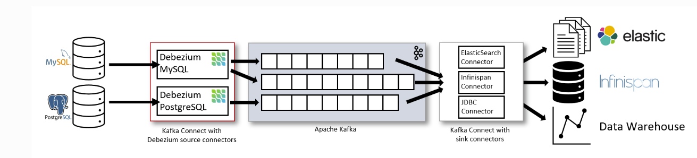
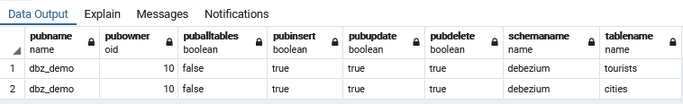
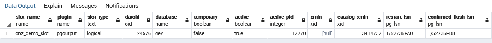
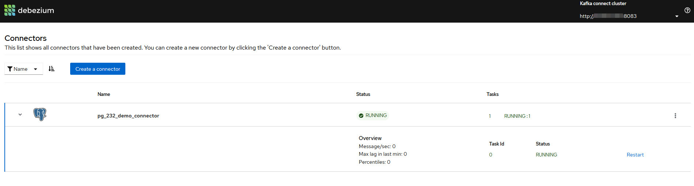
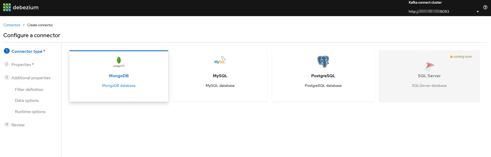

### 1. 背景

为了应对搜索的场景，需要将postgresql中的数据同步到es中，涉及到全量数据与增量数据同步。数据采集工具有很多，经讨论，初步确定为Debezium。

### 2.Debezium

Kafka Connect 是一个可靠的，可拓展的数据流转工具，可作用于kafka与各种外部系统的数据流转，比如Mysql，Postgresql，ElasticSearch等。

Kafka Connect 提供了通用的概念和API，遵循其规范开发的插件可直接运行在Kafka Connect之上，或作为Source Connector采集数据，或作为Sink Connector存储数据。

Debezium 针对不同的数据库提供了对应的Kafka Connect插件，用于Capture Data Changes，包括Mysql，Postgresql，Mongo等。




Debezium-Connector-Postgresql插件是基于Postgresql的逻辑复制特性实现CDC的。

这个机制允许从WAL日志中提取数据变化并通过Publication发布，使用解码器(pg10默认pgoutput)解码成可读的事件，订阅者可订阅该Publication，通过复制槽(Replication slot)获取事件。Debezium-Connector-Postgresql插件就是订阅Postgresql的Publication，获取数据变化，发送到对应的kafka中。

### 3. 环境搭建

> kafka 2.1，Postgresql 10已经事先安装好。

#### 3.1 Postgresql中创建逻辑复制发布

* 开启逻辑复制

  postgresql.conf调整wal_level属性为logical，该属性需要重启才能生效

  ```xml
  wal_level = logical
  ```

  查看wal_level

  ```sql
  show wal_level;
  ```

* 创建具有复制权限的用户，并赋予相关schema和table的的权限

  ```sql
  -- 创建debezium_user
  CREATE ROLE debezium_user
  	REPLICATION
  	LOGIN
  	ENCRYPTED PASSWORD '123456';
  
  -- 把schema debezium的使用权限赋给debezium_user
  GRANT USAGE ON SCHEMA debezium TO debezium_user;
  
  -- 把cities和tourists表的SELECT权限赋给debezium_user
  GRANT SELECT ON debezium.cities, debezium.tourists TO debezium_user;
  ```

  > 初始阶段的快照同步时需要访问这些相关schema和table的数据，所以需要schema和table的权限。

* 创建Publication

  ```sql
  -- 创建Publication
  CREATE PUBLICATION dbz_demo FOR TABLE debezium.cities, debezium.tourists;
  
  -- 查看Publication
  SELECT A.*, B.schemaname, B.tablename FROM pg_publication A 
  INNER JOIN pg_publication_tables B ON A.pubname = B.pubname;
  ```

  

#### 3.2 安装debezium插件，启动kafka connect

* 下载debezium-connector-postgresql插件，解压到指定路径

  ```shell
  > wget https://repo1.maven.org/maven2/io/debezium/debezium-connector-postgres/1.5.3.Final/debezium-connector-postgres-1.5.3.Final-plugin.tar.gz
  
  > tar -zxvf debezium-connector-postgres-1.5.3.Final-plugin.tar.gz /data/kafka_connect/plugins
  ```

* 修改kafka connect的配置文件connect-distributed.properties

  ```properties
  # kafka connect可横向拓展，同一个集群使用一个group id，不能与consumer的group ids重复
  group.id=connect-cluster
  # kafka server
  bootstrap.servers=127.0.0.1:9092
  # 定义插件路径
  plugin.path=/data/kafka_connect/plugins
  ```

* 启动kafka connect

  ```shell
  > cd /data/kafka_dev/bin
  > bin/connect-distributed.sh config/connect-distributed.properties
  ```

  > 可在/data/kafka_dev/logs/connect.log 查看相关日志

#### 3.3 创建connector

```
curl -XPOST "http://127.0.0.1:8083/connectors/" -H 'Content-Type: application/json' -d '
{
  "name": "pg_232_demo_connector",  
  "config": {
    "connector.class": "io.debezium.connector.postgresql.PostgresConnector", 
    "database.hostname": "127.0.0.1", 
    "database.port": "5432", 
    "database.user": "debezium_user", 
    "database.password": "123456", 
    "database.dbname" : "dev", 
    "database.server.name": "pg_232_demo",
    "slot.name": "dbz_demo_slot",
    "table.include.list": "debezium.cities, debezium.tourists",  
    "publication.name": "dbz_demo",
    "publication.autocreate.mode": "disabled",
    "plugin.name": "pgoutput",
    "snapshot.mode": "exported"
  }
}
'
```

| 属性                        | 含义                                                         |
| --------------------------- | ------------------------------------------------------------ |
| name                        | connector 名称                                               |
| connector.class             | connector 实现类                                             |
| database.dbname             | 需要捕获数据变更的数据库                                     |
| database.server.name        | pg数据库服务的名称，这个名称下可以包含1个或者多个postgresql 实例，由于一个connector下的**数据变更是发送到以server.name为前缀的topic中**，所以对于集群下不同实例的同一张表的数据变化，可以发送到同一个topic<br /><br />因此**不同的connector应当对应不同的server.name**。 |
| slot.name                   | 复制槽的名称                                                 |
| table.include.list          | 需要捕获数据变更的表                                         |
| publication.name            | 订阅的Publication名称                                        |
| publication.autocreate.mode | Publication创建模式，由于我们是自行创建，所以这里是**disabled**<br />其他包含<br />**all_tables** - 如果pg中不存在该Publication，则自动创建一个包含所有表的Publicatin<br />**filtered** - 与all_talbes不同的是自动创建只包含table.include.list的Publication |
| plugin.name                 | 使用了Postgresql 10默认解码插件 pgoutput                     |
| snapshot.mode               | 由于WAL日志不会保留全部历史，所以创建snapshot先同步数据库中已经存在的数据。<br />**exported** - 在复制槽创建时使用无锁的方式创建snapshot，debezium 1.5强烈建议使用，其他模式可能造成事件丢失。<br />**initial** - 当逻辑数据库(对应db.server.name) 没有对应的offset记录时开始创建snapshot<br />其他参见[文档](https://debezium.io/documentation/reference/1.5/connectors/postgresql.html#postgresql-connector-properties) |

connector创建完成后，就会订阅dbz_232_dev，我们可以在postgresql查看到对应的复制槽的信息

```sql
-- 查看slot信息	
select * from pg_replication_slots;
```



### 4. 测试

#### 5.1 快照数据

创建connector之后，如果订阅的表中已经存在数据，将会对已存在的数据做快照，发送到对应的kafka topic(默认是由database.server.name，schema和table组成)。比如debezium.cities的数据就会发送到pg_232_dev.debezium.cities topic中。

运行kafka-console-consumer.sh 监听该topic，分析其数据。

```shell
kafka-console-consumer.sh --bootstrap-server 127.0.0.1:8092 --topic pg_232_demo.debezium.cities --from-beginning
```

```json
{
    "schema": {
		......
    },
    "payload": {
        "before": null,
        "after": {
            "id": 1,
            "name": "b",
            "character": "{\"view\": \"沙尘暴\", \"alias\": \"首都\"}"
        },
        "source": {
            "version": "1.5.2.Final",
            "connector": "postgresql",
            "name": "pg_232_demo",
            "ts_ms": 1624952136318,
            "snapshot": "true",
            "db": "dev",
            "sequence": "[null,\"5673398848\"]",
            "schema": "debezium",
            "table": "cities",
            "txId": 3409971,
            "lsn": 5673398848,
            "xmin": null
        },
        "op": "r",
        "ts_ms": 1624952136318,
        "transaction": null
    }
}
```

| 字段                     | 描述                                                         |
| ------------------------ | ------------------------------------------------------------ |
| schema                   | 描述了payload中的组织和结构                                  |
| payload                  | json格式的事件内容                                           |
| payload.before           | 事件发生前的行记录                                           |
| payload.after            | 事件发生后的行记录                                           |
| payload.source           | 记录事件来源的相关信息                                       |
| payload.source.version   | debezium版本                                                 |
| payload.source.connector | connector类型                                                |
| payload.source.name      | connector的逻辑名称，同配置中的db.server.name                |
| payload.source.ts_ms     | 数据库中该事件发生的时刻                                     |
| payload.source.snapshot  | 是否是snapshot的一部分                                       |
| payload.source.db        | 数据库名称                                                   |
| payload.source.sequence  | 第一个值是最后提交的lsn，第二个是当前的lsn                   |
| payload.source.schema    | schema名称                                                   |
| payload.source.table     | table名称                                                    |
| payload.source.txId      | 事务id                                                       |
| payload.source.lsn       | Log Sequence Numbers 代表wal的位置                           |
| payload.source.xmin      | 仍然活动的最早的事务 ID                                      |
| payload.op               | 操作类型 c=create, u=update, d=delete, r=read<br />read 特指snapshot同步阶段的操作 |
| payload.ts_ms            | connector处理该事件的时刻，结合payload.source.ts_ms<br />可以知道延迟大小 |
| payload.transaction      | 事务元数据信息，需要额外开启                                 |

#### 4.2 变更数据

* create事件

  插入新记录后推送的数据如下，与快照的数据基本相同，这里的snapshot为false，op为c(create)。

  ```json
  {
      "schema": {
  		......
      },
      "payload": {
          "before": null,
          "after": {
              "id": 10,
              "name": "guangzhou",
              "character": "{\"alias\": \"the City of Rams\"}"
          },
          "source": {
              "version": "1.5.2.Final",
              "connector": "postgresql",
              "name": "pg_232_demo",
              "ts_ms": 1624958765094,
              "snapshot": "false",
              "db": "dev",
              "sequence": "[\"5673645496\",\"5673645496\"]",
              "schema": "debezium",
              "table": "cities",
              "txId": 3411599,
              "lsn": 5674933152,
              "xmin": null
          },
          "op": "c",
          "ts_ms": 1624958765228,
          "transaction": null
      }
  }
  ```

  

* update事件

  更新已有记录推送的数据如下，before中记录了之前的内容，after记录了之后的内容，op为u(update)。

  ```
  {
      "schema": {
  		......
      },
      "payload": {
          "before": {
              "id": 10,
              "name": "guangzhou",
              "character": "{\"alias\": \"the City of Rams\"}"
          },
          "after": {
              "id": 10,
              "name": "guangzhou",
              "character": "{\"alias\": \"the City of Flowers\"}"
          },
          "source": {
              "version": "1.5.2.Final",
              "connector": "postgresql",
              "name": "pg_232_demo",
              "ts_ms": 1624959006739,
              "snapshot": "false",
              "db": "dev",
              "sequence": "[\"5674934168\",\"5674934168\"]",
              "schema": "debezium",
              "table": "cities",
              "txId": 3411658,
              "lsn": 5674995568,
              "xmin": null
          },
          "op": "u",
          "ts_ms": 1624959006982,
          "transaction": null
      }
  }
  ```

  > 默认情况下，表的复制标识(Replica identity)为default，即订阅者根据行记录的主键来定位到对应行的记录，这种情况下，before字段中不会有行记录的全部内容。
  >
  > 如果需要返回行记录的全部内容，可修改表的复制标识为full

  ```sql
  -- 修改Replica identity
  ALTER TABLE debetium.cities REPLICA IDENTITY FULL;
  -- 查看表的replica_identity
  SELECT CASE relreplident
            WHEN 'd' THEN 'default'
            WHEN 'n' THEN 'nothing'
            WHEN 'f' THEN 'full'
            WHEN 'i' THEN 'index'
          END AS replica_identity
   FROM pg_class
   WHERE oid = 'debezium.tourists'::regclass;
  ```

* delete事件

  删除记录推送的数据如下，before是删除前的数据，after为null，op为d(delete);

  ```
  {
      "schema": {
  		......
      },
      "payload": {
          "before": {
              "id": 10,
              "name": "guangzhou",
              "character": "{\"alias\": \"the City of Flowers\"}"
          },
          "after": null,
          "source": {
              "version": "1.5.2.Final",
              "connector": "postgresql",
              "name": "pg_232_demo",
              "ts_ms": 1624959858803,
              "snapshot": "false",
              "db": "dev",
              "sequence": "[\"5674995800\",\"5674995800\"]",
              "schema": "debezium",
              "table": "cities",
              "txId": 3411864,
              "lsn": 5675157120,
              "xmin": null
          },
          "op": "d",
          "ts_ms": 1624959859169,
          "transaction": null
      }
  }
  ```

### 5. 可视化管理

#### 5.1 debezium-ui

* docker方式安装debezium-ui

  ```shell
  docker run -it --rm --name debetium-ui -e KAFKA_CONNECT_URI=http://127.0.0.1:8083 -e UI_BASE_URI=http://127.0.0.1:8080/api -e JAVA_OPTIONS="-Xmx256m"  -p 8080:8080 debezium/debezium-ui:1.5
  ```

* 使用debezium-ui http://localhost:8080

  * 查看connector

  

  * 创建connector

  


